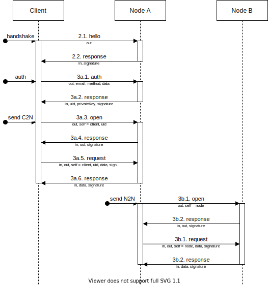

# Authentication with Neuron
Since Neuron uses WebRTC to communicate between the client and nodes, authentication is needed to ensure that both the client and the nodes can be trusted. WebRTC is SSL encrypted, which is a great start in making sure that connections are secure and private. However, since nodes and clients essentially exist in the same space, both nodes and clients will need to be able to determine their trust towards one another. This document outlines how we will implement this trust-based system.

The key words 'MUST', 'MUST NOT', 'REQUIRED', 'SHALL', 'SHALL NOT', 'SHOULD', 'SHOULD NOT', 'RECOMMENDED', 'MAY' and 'OPTIONAL' in this document are to be interpreted as described in the [IETF BCP 14](https://www.rfc-editor.org/info/bcp14).

## 1. Discovering nodes
**1.1.** For a client to connect to nodes, it will need to first discover those nodes. This can be done via a simple static file which is stored on a web server. The web server MUST serve this document over an SSL-encrypted connection. The format followed for this file SHOULD be similar to the following:

```json
{
    "host": "peer.example.com",
    "port": 443,
    "path": "/",
    "iceServers": [
        {"url": "stun:stun1.example.com:19302"},
        {"url": "stun:stun2.example.com:19302"},
        {"url": "turn:username@turn1.example.com:443", "secret": "secretSuchAsPassword"},
    ],
    "nodes": [
        {"id": "neuron_liveg_eu-west1_IuDrfE29DnlB2KU7", "publicKey": "MIIBIjANBgkqhkiG9w0BAQEFAAOCAQ8AMIIBCgKCAQEAxDn5MDN2tpkWKac8ICXjb8I7zljdYjYjFrxQ9IOGLNTfeqsRNuz+ZSVwBgES1fyYBzrx1fsV4JvzohdqKhoh+pwREl3eR7Ug+IDhvXtbeGSd8BF+GmJ0aLJN/MQMy+bppGmxRgHnbUwBrCdJlJAN59VEEfWRCmg4cqFBQo6/tiVBGQ3u6HlghypDs/yJ/WsiafWDiUGnwIkei0kme9ivrtkV1EicpxMCCZbU1UIoqNwvyMhYYQDRmGLC3Tz/njm+QT2DN4XZcq1lkltk8RrXnyXZzwJ2j9M+dI0xqNQSP67HVZGIT9NEV4ef7cVk0N5uw87b7Hr/8MqZNTd9MDvpgQIDAQAB"},
        {"id": "neuron_liveg_eu-west2_8uUAOTuurxrQgQG_", "publicKey": "MIIBIjANBgkqhkiG9w0BAQEFAAOCAQ8AMIIBCgKCAQEAszdDKgkdljFriM+xz9RfQb2JJ/xco8XNEtg0gDn8wSA4JMjqUa2aSSRwjJzIYqCbkApFQ0mrYcf6cvVINaHsnjy7JAtTecIAAyY5NfsR4SVqW/9fzm7dGTxH4EK5R4g0SFQBrCP8EwJxBCRofvOAGTOYfhl6PkB88kK0M7DwObrH54gOsMMhp7gd6oarfRcH4ZPzaPcQfAklsLO/oltfUeODDI386k4GYz4o+cBljgZ1uoFqBRGbpj5NXN3dkE3WvaWQ94lVFcmPd8NF4BgLwLz43bXDEWclaoOUcHJrUC9LosASYV9hTZtRD7LqKeHs4bM1VqI+N/SPwhOnitX+jQIDAQAB"}
    ]
}
```

**1.2.** Clients can then use the nodes list to both connect to nodes and verify their integrity using the `publicKey` property, formatted as an RSASSA-PKCS1-v1_5 SPKI-formatted public key. There MUST be at least one node for connecting to the network, and there MAY be more than one node in the list to ensure a reliable connection.

## 2. Connecting to nodes
**2.1.** On connecting to a node, its integrity MUST be verified before a peer can begin to expose private information to the node. This is to ensure that peers cannot talk to untrusted nodes operated by malicious actors. The peer MUST send the following message data to the node:

```json
{
    "type": "hello",
    "out": "b659234bd627fc73"
}
```

The `type` property specifies that the message is intended as a connection handshake. The `out` property specifies that the node MUST respond with the same given value for communications purposes. The `out` property's value MUST be signed by the node using its private key using the RSASSA-PKCS1-v1_5 algorithm for the connecting peer to verify the node's integrity. The `out` value MUST be randomly-generated to prevent the chance of replay attacks.

**2.2.** Once signed, the node MUST respond with:

```json
{
    "type": "response",
    "in": "b659234bd627fc73",
    "signature": "c2fdc2c298ed3e93f4a5be8d27c7298aa0acfe8c6b8aaadfb09a9045ead32defef09ead4781ba6d0afc6999e6f1a591a7d93a61cdc03a63ba9f8d8e6a39d9b0d36fa371351ff524221eb27c914f14ea1f714e6880e3852a0d9b4e453830bccbf52ee0848990c462322c972331241a8a4035208ab7133a97b2b2e6fc48fd6f5c0c6d292c40af37930b04a012e36ff898167b9866caa11668dc2e298bb1863a7373b34aa63f08859e45dd5768c432c96ba129d798354eb87eb42f1c53741033abf11b02a22d75c159c6628cc4775b839843ddd0385c54f5b59295f79450fdbf857d08a147dd1da7e935b74e1b7a6d00e2075d78efe32881c704aa99ad7e1756fc5"
}
```

**2.3.** The requesting peer MUST verify this data. The `in` property's value MUST match that of the requesting peer's `out` message property value. The `signature` property's value MUST contain the signature of the given `out` value for verification by the connecting peer.

All communications between the peer to the node SHOULD then be continued using this communications structure.

## 3a. Sending messages to nodes as a client
**3a.1.** As a client, communications to nodes MUST be authenticated so that nodes can be confident that the intended requestor is genuine. Clients MUST sign into the network by communicating with a node as follows:

```json
{
    "type": "auth",
    "out": "ef509181d0d08b2b",
    "email": "user@example.com",
    "method": "password",
    "data": "passwordGoesHere"
}
```

**3a.2.** The node MUST respond with a given predetermined private key for the user which is shared between nodes. The node MUST respond as follows:

```json
{
    "type": "response",
    "in": "ef509181d0d08b2b",
    "uid": "Y3tgT2YhY00qZFxz",
    "privateKey": "MIIEvwIBADANBgkqhkiG9w0BAQEFAASCBKkwggSlAgEAAoIBAQCiBgEMwzarT00COwFpzaa1kN+HfZ2Sm784PQZOo/eQqtl1IE4NMvezU6bIQL+OcSK3E0R/C0MzUeftOgG3MOb1/XDypSgndDsMbUIncnQ649wCg1RCGef//k4OnMm1A0esnyDt68zvIThd6JtpLjJzWuflkGyLT7VDy37IHlz61tgsI6wvhaCyslaI3tjq4NWO/z/FSF+Du94Nma1+SNuaL0rntxCMnA/OnUTRjR50ItLxZd43tJCUY1z5w4zBFLkMj9vpEbWqrRc/9awFBIYebTrqgCEYFt+v+lbgtIgTYsNcArldqC6tWCKGx56VhQ5gUg9Fy/wcKtBBHgKH0odpAgMBAAECggEAAV5OnPZ7HDhHvLiV2vhnK4plMOZBMe9JzqZJStm8qgafXotezWK8T9HpizBszb2r3uL1RaNpNmI/NLQ0NoFduf8heJMngynKo+C6Wc3wKF0rSwQj7oj8eh+CNkJhu7si3FTduNSwfuaHbNedlGZU+79tTPWKzSRnsgJieDs1atLpQMRqd42bjJW4eTsz2KYZ4S28thj5lL5q7Mo8XqCPHRZygSkro3RYZTe3DxHKpahoXpJNBAr9pQhlWNCzV1PCiyg0v4XlAQT5zGL2Gmc85KXorP5MadO/+MeyLuyiZXQrGU2q7p6p9ISG3Iu+FTMzgh0Tgt8ddFoQzMxaAWQTQQKBgQDNb9GcGtaRNMAUq69Yu3k+j+BNQ84zaSy3MDRDK/QD52JXDs/qaMBKPEvFrGWShPE8yHXxwTlwqL1uxqOPlH7gfA/6REBJo0ir4ry+vnMDlB+AxZ8rrOU3e+wfKDotf5RX4NZr1dNpKlhysHNle28lOW9j2hJy+7bG3beXu/RSUQKBgQDJ5ssh5txW3Ge1SGgfW5lL8LqiGvHhTpehVZMhTuVEFuf3f1N4LZQm5qzyLce049Y6XG2vtv+MIyF6AwB3Q6oGZDbZNnFwOzPwoY3NbMyTAxxR5JoBnf6kfUk0bWd5SymCnqnECCI1H8xna6wKajMvE6byq/SWF6f/vQ6hfeXFmQKBgQC8U+i1EYln3hLEIEuDrYFNj/nQ+vrZ+G3MlX0jovR0a7akFmkV++djZnkUAqGuuv6neSFeeYMduyLFnYWthzT0t+axx8Wje/OP1zCuL8siGbTziLcNA9exkIH6YhdLRGyKTwxiGMhQ3UfuA8IV4x0V49wwjmZhUE3Tasf2apBksQKBgQDJZweVHvUHVL/DT6JGPZpy7YVPNa+5gCuzzWiCXnBHds4YzpOWG2lhUNSOlOpVYL2P5CmqkdLjmRvI2Xu6fO37iDZKgYuxV+1dCdspY3HC6OR0MKUMHe4paaz/tm70yOx0lw9kNHTjJ4BAXmD01rGOMX1lL/FBVAHLE22n3K27aQKBgQCHJ60wjcBrzcJCiTFZ9NSJ8dehPrctzBOyJXxj/DrOUKxxOayKgbYE/4u0wCjuME6H3yYN0moG6rMjKIx6XaTGwlKOzEOoPMarurcaOnxDW1DXek7aAkcAWeywiDTkf6ku5tG2iB3BvnXyGCqidPezoukXuHEhzJpJeJuqZjCjAQ==",
    "signature": "041cb08a6d5480b2c2f9987513315cfc347146d7a87e99b7fad922d8bb1988d9a4478955f1075cfd8a9addf2b2f657ce5a2b5af6b6e07d64300d188ef02d21ec94affa16de9458f0b3d1f314213a326996ae864a091d8734fc86f38e58ef93f57f51aa57038e34b7d317a87280d309aca7bf41401e89d3a07e0ff1c33659ce2872f8f3a21c031849b6436581cf5fabf2abd15ac30d60be85ef7f9232bccf1c298e031ff9e8508c627dc2acfa3d3efc71e0df2208eefccbb8a4dce1f556c1ea91663ed4b0827e8178d1987d6979d32efbdb90fbdc3b8f2cfe80846c681bee77bbbc28bff18a200171f1323faab42b10f216bc98346592824f784b988b056745b6"
}
```

The `type` and `in` properties are the same format as the handshake process. The `uid` property contains the client user's unique identifier. `privateKey` is the given key to be used by the client for further authentication. The client MUST sign their messages using this key.

**3a.3.** To begin sending the message, the client MUST request the node to generate a value to sign so that the node can trust the client, known internally as _opening_. This is similar to the handshake process, but towards the client instead. The client MUST send a message containing the following data:

```json
{
    "type": "open",
    "out": "ef509181d0d08b2b",
    "self": "client",
    "uid": "Y3tgT2YhY00qZFxz"
}
```

**3a.4.** The node MUST respond with the following message:

```json
{
    "type": "response",
    "in": "ef509181d0d08b2b",
    "out": "945f65e666e62020",
    "signature": "8bcaf1fd952594bc9c18c618551a35adb23dc3a7f9072cff3e34eee064b14a087912c26b04f17ea22662dab2ec1d02fc12aed5786562d0fad346b01ca2aa483c6d91f1e15c8ab2798dd39e9f55672d63a1e928e00df8a40f40142e89dce6c0acd331b209ce7be11f631b080d70a89512ace52cf2e285cef3e40fc62c2c3aac8b67561e08e7612e18623dd0db33818609356b00a0e7b8b6302bd925004667a258eae4534dd6c835e15a704404840bb52d4622f4185488a6c80dc650264bbcefd0ef08992473c5d68e736975012e09fef39d1fa4573ee829eba0b10de756025ab73aedccffe8ba0dec536f100b76a6b900e4b196df4b9e8d94f37d6e8da9872ca8"
}
```

**3a.5.** The client MUST then verify the node's signature, and then sign the `out` property's value when sending the main message:

```json
{
    "type": "request",
    "in": "945f65e666e62020",
    "out": "eebf0741b96e02f0",
    "self": "client",
    "uid": "Y3tgT2YhY00qZFxz",
    "data": "Any arbitrary object data can go here for requesting",
    "signature": "8862604922d60bc165b5d193f5d45e3686209edd103b8298d4988530841142192ef6973ddc8bc41d316ccba09904354f679b71e318f548f124ecb9be631aecdb01a931b1cd615862650dc519dc184d9f6526080e01f3edabede8827df34e77232c7937da8585d59ce48f47b6f34c58dca6c2a4f2d4d15f3d3ddd166774c596318b34f43180b36cd63324ba42ccebdf6da48f940052323be67d4d3f516e51ceb45fe0ae6b58a42002a923657ea0c4f61981824e9b6fbb8ffca8e2f566dc025ce2b8f3d0651e21bf6c27ab8c3da6ce9b7da063f22900bdc0597422a88fd4b572a999dcbcd3eb5df287a5a71785a135fd9a3e0c99751008565b08a18c1405692010"
}
```

**3a.6.** Much like a node's handshake response, the client MUST respond in the same way. The signature MUST then be verified by the node before responding:

```json
{
    "type": "response",
    "in": "eebf0741b96e02f0",
    "data": "Data from the node can go here when responding",
    "signature": "4a3f73cb49ba14f6eeacebfe38621b51fcce4acb80458f5bfabbfecdc76d92dc303552e95d94c88fc48a898eab436d99041d0ab0af6a473cba32b39940edffd5689e3a336541bdb332b69a7d30183b22486f5c5bc2810e92c5d543618315d46852b9fca805227aa9d191a43f88729a6b7d7c6ea35bd430ed86da537751ec83987d2181dc82fb5bfd8ff8dc95d48821aa122d7fa2cfdcd359e608f33c61d678b2dcdc9cad3efc964c9edb24a19823b92bd3e0b6d6d50158d61ca09de3679b2eee22161b6acc3ba9222c9e458d742c42fa1a106ccf5b28590493e09a4680a844980746019e7c2f44d1b4252133cd438cd355e0594115fa0d487e4b99d20c402758"
}
```

**3a.7.** The client can then verify whether this response is genuine. This is the final message to be sent to complete one request cycle. The client MAY send another request by _opening_ a new message.

## 3b. Sending messages between nodes
**3b.1.** As a node, communicating with other nodes works differently since authentication is not on a user basis. To begin sending the message, the sending node MUST request the node to generate a value to sign so that the receiving node can trust the sending node, again through the _opening_ process. The sending node MUST send the following data:

```json
{
    "type": "open",
    "out": "b79bd18c00e6be8c",
    "self": "node"
}
```

**3b.2.** The receiving node MUST send the following message back:

```json
{
    "type": "response",
    "in": "b79bd18c00e6be8c",
    "out": "b73c09c75f8d9da8",
    "signature": "3aea2ea7fd2d3c5e155dbb0794ac4eebf798d4fb0ca8b1ecad8e0145d028371975b566e00e95787cd9e14260f7e58361c36fabe4b7577506aa0332cfa854262cea31ae8f73147a42331b4cad8ea06a8dd4f8ea3d1ad193f1e83b7470a643909cd8fcc864e44cca0e4752c77eba7386987e57e774634c3f4c96243d576dc557c3111fb83b55697cfce24edfebce6fefe203ef5c54a67cf9c8f34353f2d46d4e3422a5a2e435ddef4f4eeca73355e63b04bc68d71312f35e17dd5b9acceaaabdea0f52005b947aea3de13af757d5a47a945f40cb2e5c08fc52fa0d63d290d84467f67831e61a41ab5a92f07744b4de1bc315b1b0d5ba2112a5adb59ee030c53344"
}
```

**3b.3.** The sending node MUST verify this signature. The sending node MUST then prove its trust, too, when sending over the main data:

```json
{
    "type": "request",
    "in": "b73c09c75f8d9da8",
    "out": "92c701f591992761",
    "self": "node",
    "data": "Any arbitrary object data can go here for requesting",
    "signature": "df490cf4fe4fb7d0c78f9003a7adaf5ad23857998e1c32bedda0dfb730272ede08338f8891d77a218193cfab9bac3aaccb7622f2bb0e73588b497bf2c2e4bcf97d3d44af8640741dbd985e9862bbe5f52a7c6b7c40a4e6ed8e31b5717d5341a511e98064a762aaddd1f8c22b03a67a06ec1ff31c66379389bfd85884de1a4b7386721e2a1d6a19ec80b094970d3cac336976c14d11a71b4c160e49793b6d280ffad1ca4b9a131a37e27ac0bdadb53857f1979f2b52e0f5d62de3f0e90cb6ceb3f876a1c429fcfc05b451498375672d2a24030b3be8c1cc8f98f58c9246616ad27fd91f65840da4646dfbd4c39a465af054cd88f18d53cc3d3e209a63ea2dae05"
}
```

**3b.4.** The receiving node MUST then use the node discovery file to determine whether the sending node is genuine, by using the sending node's unique identifier and public key (as listed on the node discovery file) to verify the signature of the `in` value. Once verified, the receiving node can then return any data:

```json
{
    "type": "response",
    "in": "92c701f591992761",
    "data": "Data from the receiving node can go here when responding",
    "signature": "7b1b7b7fa96493f6cfb0f9add623a1e6b87bb053f9399795e4a211dcec5c168e7a76da4b44a56d9d00fbc7bf10b57fc72447aa7ac7c07bca47ad137286d19f7b2c834ee3ebf714a264bd729a005b25816eeec520be8e914f6b5aa74e6199241ee9e9bd29aa311e00bacdf8a7d0d0ea88a3a543aae43ac3fa6d8d2bcd43a72ec3c57a4df98e178e1cc963d028923ebbdb681077e02d3dfb10317624db62d1c18339a2f83282a9cd0ac7e7552db8ed028224d10e8ee0cabcb962665aa59f55385797188f53b08a473dfb2abf908975a35c9b43215591315734c8238d95d7f9ceda7f4b3ea99f249953d32dc00fa2b1f639353d462f02de153b455f80d4ff6bec83"
}
```

## Communications overview
Below is a diagram representing the communications flow between a client-to-node (C2N) connection and a node-to-node (N2N) connection:



## Third-party applications access
Since third-party applications may require the access of data held within Neuron, a method for communicating between that third-party application and the Neuron system itself must be devised. To achieve this, LiveG will implement an iframe-based library which third-party applications can then embed and communicate with for managing data held under a user's account.

This system provides multiple advantages:

* The user is conscious about when third-party applications access their data since the application must be open on the user's device, instead of connections through an application's backend. For example, an application may want to save a file to the user's account, and so the application must be open on the user's device to perform such action.
* User interfaces such as save/open dialogs are easy to present since they can be contained in the iframe and then shown to the user.
* Modern browsers implement their own stringent cross-origin policies that prevent third-party applications from abusing embedded content. All communications between the third-party application and iframe are to be carried out by using `Window.postMessage()`.
* Data is accessed on a per-user basis, meaning that third-party applications are not billed based on their usage, and all requests are made client-side.
* Permissions can be easily configured on-the-fly through a user interface presented inside the iframe.

However, it is important that we respect browsers' privacy choices; namely WebKit's [Intelligent Tracking Prevention](https://webkit.org/blog/7675/intelligent-tracking-prevention/) which aims to prevent advertisers from tracking users through third-party embeds by partitioning access to site local storage. For us to bypass these protections, we can use the [Storage Access API](https://webkit.org/blog/8124/introducing-storage-access-api/) provided by WebKit as a response to the needs of embedded authentication and payment systems (which are not too dissimilar to our use case).

The Storage Access API requires the user to interact with the embedded content, and when access is granted, the embedded content can then access its first-party local storage. If, for whatever reason, no access can be made via this API, then local storage will be partitioned and therefore the user will be asked to sign into LiveG to allow the third-party application to access the user's data.